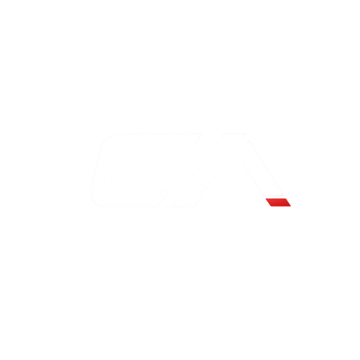

# CONTRACTOR ARSENAL — V2 WEBSITE OVERHAUL SYSTEM (CLAUDE.md)

## MISSION

Contractor Arsenal is evolving from:
- a contractor marketing agency

Into:
- a premium contractor growth platform

The website should no longer feel like:
- a freelancer portfolio
- a local agency
- a contractor template

The website SHOULD feel like:
- a premium SaaS company
- a venture-backed contractor platform
- an elite growth infrastructure company
- a category-defining brand

The visual quality should compete with:
- Design Pickle
- Linear
- Stripe
- Ramp
- Framer
- Clay
- Attio

But adapted specifically for:
- contractors
- trades
- local business growth
- lead generation

---

# CORE WEBSITE PROBLEM

The current website suffers from:

1. Too much darkness
2. Inconsistent design language
3. Mixed accent colors
4. Generic agency structure
5. Weak platform feeling
6. Too many centered layouts
7. Weak visual rhythm
8. Weak navigation strategy
9. No strong UI moments
10. No memorable visual identity

The current site feels:
> “well coded”

But not:
> “art directed”

---

# PRIMARY OBJECTIVE

Transform Contractor Arsenal into:
> the most premium contractor growth brand in the Pacific Northwest.

The site should feel:
- intentional
- cinematic
- tactical
- engineered
- conversion-focused
- modern
- high-end
- handcrafted

NOT:
- AI-generated
- template-based
- generic
- over-animated
- startup cliché

---

# BRAND FEELING

Contractor Arsenal should feel like:

- Apple × Contractor Industry
- Linear × Local SEO
- Stripe × Contractor Lead Generation
- Design Pickle × Contractor Systems

The emotional reaction should be:

> “These guys are serious.”

And:

> “This feels bigger than a normal agency.”

---

# DESIGN SYSTEM

# COLOR SYSTEM

## CURRENT PROBLEM

Too many colors:
- orange
- gold
- red
- dark red
- muted orange

This weakens:
- consistency
- memory
- premium feel

---

# NEW COLOR SYSTEM

## PRIMARY BACKGROUNDS

```css
#0F1115
#151922
#1B2130
#F5F7FA
#FFFFFF
```

IMPORTANT:
The website MUST include:
- light sections
- bright breathing areas
- contrast transitions

The website should NOT remain fully dark.

---

# PRIMARY ACCENT

```css
#D8FF3E
```

Use this as:
- CTA color
- hover states
- accent bars
- active states
- section highlights
- floating cards
- footer strip

---

# SECONDARY ACCENT

```css
#FF5E2B
```

Use sparingly.

Avoid:
- too many gradients
- rainbow accents
- excessive glow

---

# TYPOGRAPHY SYSTEM

# HEADLINES

Allowed:
- Bebas Neue
- Geist Bold
- Anton

Headlines should:
- feel massive
- feel aggressive
- feel memorable
- feel expensive

GOOD:
“WEBSITES THAT WIN CONTRACTORS JOBS.”

BAD:
“Innovative digital experiences for scaling brands.”

---

# BODY FONT

Allowed:
- Inter
- Geist
- Satoshi

Body copy should:
- scan easily
- use short paragraphs
- avoid fluff
- prioritize clarity

---

# NAVIGATION SYSTEM

## CURRENT PROBLEM

Services currently scrolls down the homepage instead of routing to a dedicated page.

This creates:
- UX confusion
- poor structure
- weak SaaS perception

The website currently feels halfway between:
- landing page
- multi-page platform

This must be fixed.

---

# NEW NAV STRUCTURE

Desktop nav:

- Services
- Industries
- Work
- About
- Demo CTA

ALL SHOULD BE REAL PAGES.

NO HOMEPAGE ANCHOR LINKS.

---

# LOGO SYSTEM

## IMPORTANT

The navbar should ONLY use:
- the uploaded contractor icon logo

NO TEXT.

NO “Contractor Arsenal” wording in nav.

The logo icon alone is stronger, cleaner, and more premium.

---

# LOGO RULES

## NAV

ONLY:
```html

```

NO TEXT BESIDE IT.

---

## HERO

Use typography instead:
```txt
CONTRACTOR ARSENAL
```

as part of the hero section.

---

## FOOTER

Can use:
- full wordmark
OR
- icon + wordmark

---

## FAVICON

Use:
- icon only

---

# HERO SYSTEM

## CURRENT PROBLEM

Hero still feels:
- agency-like
- template-ish
- predictable

Needs:
- more asymmetry
- more depth
- more visual proof
- stronger platform feel

---

# NEW HERO STRUCTURE

## LEFT SIDE

Massive headline.

Subheadline:
- contractor-focused
- lead-focused
- growth-focused

Buttons:
- Get Free Demo
- View Transformations

Trust row:
- contractor types
- review count
- jobs generated
- local authority

---

## RIGHT SIDE

NOT:
- generic contractor photos

Instead show:
- website transformations
- before/after layouts
- rankings
- dashboard snippets
- CRM visuals
- SEO tracking
- lead systems
- mobile website previews

The hero should immediately communicate:
> “This is a contractor growth platform.”

---

# FLOATING OFFER CARD

## REQUIRED

Add floating bottom-left promo card inspired by Design Pickle.

Desktop:
- fixed bottom left
- rounded
- premium
- subtle motion

Mobile:
- delayed slide-up
- smaller
- dismissible

---

# OFFER IDEAS

- FREE Contractor Website Demo
- Save 30% on Setup
- Get a Free Homepage Redesign
- Free SEO Audit

---

# OFFER CARD STYLE

Use:
- lime accent
- black background
- soft shadows
- playful but premium

DO NOT:
- make it flashy
- use spammy animation
- overdo motion

---

# SECTION STRUCTURE

# HOMEPAGE FLOW

## 1. HERO

Aggressive contractor-focused messaging.

---

## 2. TRUST STRIP

Metrics:
- projects completed
- contractor niches
- rankings generated
- local presence

---

## 3. WEBSITE TRANSFORMATIONS

Before vs after.

Show:
- ugly contractor sites
- redesigned versions

Make transformations dramatic.

---

## 4. WHY MOST CONTRACTOR WEBSITES FAIL

Discuss:
- poor SEO
- no trust
- weak mobile
- no CTA
- bad messaging
- no local optimization

This section should create urgency.

---

## 5. GROWTH SYSTEM SECTION

Explain:
- websites
- SEO
- CRM
- automation
- AI systems
- lead capture

Position Contractor Arsenal as:
> infrastructure

NOT:
> “just web design”

---

## 6. INDUSTRIES SECTION

Dedicated contractor industries:
- Roofing
- Painting
- Landscaping
- Concrete
- Remodeling
- HVAC
- General Contractors

Each card should:
- feel custom
- feel real
- avoid stock feeling

---

## 7. PROCESS SECTION

Simple:
1. Strategy
2. Build
3. Launch
4. Optimize

Avoid:
- cheesy agency diagrams
- overcomplicated flows

---

## 8. RESULTS SECTION

Show:
- rankings
- leads
- screenshots
- traffic growth
- contractor wins

---

## 9. TESTIMONIALS

Preferred:
- video
- real faces
- real contractor companies

Avoid fake-looking cards.

---

## 10. FINAL CTA

Massive closing section.

Example:
“READY TO BUILD A WEBSITE THAT ACTUALLY GENERATES JOBS?”

---

## 11. FOOTER

Large enterprise-style footer.

Must include:
- multiple columns
- huge spacing
- breathing room
- accent strip at bottom

Inspired by:
- Design Pickle
- Stripe
- Framer

---

# FOOTER STRUCTURE

## COLUMN 1
Brand statement.

## COLUMN 2
Services.

## COLUMN 3
Industries.

## COLUMN 4
Resources.

## COLUMN 5
Contact.

Bottom:
- full-width lime accent strip

---

# LAYOUT SYSTEM

## CURRENT PROBLEM

Too many:
- centered sections
- equal card layouts
- symmetrical blocks

This creates:
- developer feel
- template feel

---

# NEW RULES

Use:
- asymmetry
- overlapping cards
- broken grids
- layered sections
- varied spacing
- large breathing zones

Premium brands intentionally break rhythm.

---

# SPACING RULES

Sections should feel:
- cinematic
- breathable
- intentional

Avoid:
- cramped layouts
- identical padding
- repetitive spacing

---

# CARD SYSTEM

Cards should:
- feel elevated
- feel layered
- use subtle borders
- use soft shadows

Cards should NOT:
- feel flat
- feel Bootstrap-like
- feel generic

---

# MOTION SYSTEM

Motion should:
- support UX
- guide attention
- feel expensive

Allowed:
- subtle fade
- hover elevation
- smooth transitions
- slide reveals

Avoid:
- excessive animations
- bouncing
- spinning
- gimmicks

---

# IMAGE SYSTEM

ONLY USE:
- real contractor work
- real screenshots
- real websites
- real transformations
- real dashboards

Avoid:
- fake AI imagery
- generic startup illustrations
- random stock people

---

# MOBILE EXPERIENCE

Mobile is priority.

The website must:
- feel premium on mobile
- keep strong spacing
- maintain typography hierarchy
- maintain CTA visibility

The floating promo card must work beautifully on mobile.

---

# PLATFORM FEEL

The website should feel like:
- a contractor operating system
- a contractor infrastructure platform
- a growth ecosystem

NOT:
- “just another web agency”

Add visuals for:
- CRM systems
- lead tracking
- SEO monitoring
- workflows
- automation
- contractor pipelines

---

# COPYWRITING RULES

## NEVER USE

- “innovative solutions”
- “digital experiences”
- “transform your online presence”
- “scalable ecosystems”
- generic AI wording

---

# GOOD COPY

“Your website should bring in jobs.”

“Most contractor websites fail in under 5 seconds.”

“Built to rank. Built to convert.”

“We build contractor growth systems.”

“Contractors don’t need prettier websites. They need more booked jobs.”

---

# FINAL GOAL

The final website should feel like:
- a category leader
- a premium platform
- a serious business
- an elite contractor growth company

When someone lands on the site:
they should immediately think:

> “These guys are on another level.”

AND:

> “This feels bigger than a normal marketing agency.”
